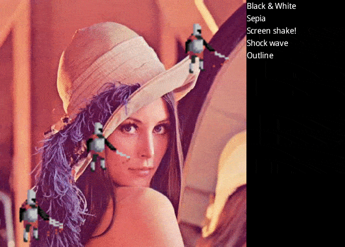

# gdx-gfx

Add some post-processing effects to your libgdx game.

## Setup

Your project needs libgdx starting from version 1.8.0.

Add the pretty **bold** parts into your _build.gradle_ file:

<pre>
    project("...") {
        
        ...
        
        dependencies {
            ...
            <b>compile "games.spooky.gdx:gdx-gfx:0.0.4"</b>
        }
    }
</pre>

## Usage

The library currently exposes two interfaces that you may implement:
* `VisualEffect` for effects that apply to the screen or to an intermediate _Frame Buffer Object_ (FBO)
* `TemporalEffect` for effects that evolve with time

### Visual effects

#### Interfaces

A visual effect (implementing the `VisualEffect` interface) is applied onto a Texture towards the screen or a FBO.

Two methods need to be implemented for a visual effect:

<pre>void rebind()</pre> Called when OpenGL context was lost and is being bound again.

<pre>void render(Texture source, FrameBuffer destination)</pre> Called on every frame, real magic should happen here. The destination FrameBuffer you provide may be _null_, in this case rendering is to be applied to the back buffer (ie the screen itself).

#### Shaders

A common usage of such effect is to apply a _shader_ to a whole-screen texture rendering.

To this extent, the ShaderEffect abstract class brings some extra candy to your shader-handling code.

First, rendering is applied by default to the simplest mesh encompassing the whole screen. So instead of overriding the `render(Texture source, FrameBuffer destination)` method, you override `actualRender(FrameBuffer destination)` as mesh creation/usage is basically handled by the class.

Second, all the fluff around _shader parameters_ is streamlined, just look at the example below.

Considering the (oversimplified) shader:

	uniform sampler2D u_texture0;
	
	uniform vec2 u_offset;
	uniform vec4 u_color;
	uniform float u_filter;
	
	varying vec2 v_texCoords;
	
	void main() {
	
	   vec2 coords = v_texCoords.xy + u_offset;
	   
	   float alpha = step(u_filter, texture2D(u_texture0, coords).a);
	   
	   gl_FragColor = vec4(u_color.r * alpha, u_color.g * alpha, u_color.b * alpha, alpha);
	}

You may create the effect:

```java
private final Vector2ShaderParameter offset;
private final ColorShaderParameter color;
private final FloatShaderParameter filter;

public MyShaderEffect() {
	super(new ShaderProgram(CommonShaders.Screenspace, stringContainingFragmentShader));
	
	offset = registerParameter("u_offset", 0f, 0f);
	color = registerParameter("u_color", Color.WHITE);
	filter = registerParameter("u_filter", 0f);
}

@Override
public void dispose() {
	super.dispose();
	this.program.dispose();
}
```

And then expose the shader parameters via mere getters and setters if you wish:

```java
public Vector2 getOffset() {
	return this.offset.getValue();
}

public void setOffset(float offsetX, float offsetY) {
	this.offset.setValue(offsetX, offsetY);
}

public Color getColor() {
	return color.getValue();
}

public void setColor(Color color) {
	this.color.setValue(color);
}

public float getFilter() {
	return filter.getValue();
}

public void setFilter(float filter) {
	this.filter.setValue(filter);
}
```

All proper GL calls and rebinding are automagically handled!

Various parameter types are available (int, float, float[], Vector2, Vector2[], Vector3, Vector3[], Color, Matrix3, Matrix4), more could be added later.

Some even-more-streamlined classes are available for even-simpler shader use cases.
If you need an effect with a single shader pass, you may use SinglePassShaderEffect and only provide the `ShaderProgram`.
If you don't feel like creating the `ShaderProgram` yourself, go with an `OwnedSinglePassShaderEffect` which will take care of creating (and disposing) the `ShaderProgram` object for you.

Important side note:
The `ShaderEffect` and `SinglePassShaderEffect` are not responsible for creating the `ShaderProgram` object, thus not for destroying it either. It is **your** responsibility to call `dispose()` on the shader program after use!

#### Examples

[`Sepia`](src/test/java/games/spooky/gdx/gfx/demo/fx/Sepia.java), a simple single-pass shader effect.

[`Outline`](src/test/java/games/spooky/gdx/gfx/demo/fx/Outline.java), a non-trivial example of visual effect involving some compositing.

### Temporal effects

A temporal effect (implementing the `TemporalEffect` interface) is updated each frame until finished.

Two methods need to be implemented for a temporal effect:

<pre>boolean update(float deltaTime)</pre> Called every frame with the time elapsed since previous frame, in seconds. Return true if the effect is finished and should not be applied anymore.

<pre>void reset()</pre> Called in order to re-use the temporal effect.

Implementation is rather up to you on this one!

#### Example

[`Screenshake`](src/test/java/games/spooky/gdx/gfx/demo/fx/ScreenShake.java), some nice camera shaking.

### Combining

It is possible to combine several effects into a single one with the help of some nice utility classes.
	
`MultiVisualEffect` lets you combine several visual effects, one after the other. Every effect is applied on the result of the previous one. Automatically handles `Disposable` children when disposed itself. `MultiVisualEffect` being a `VisualEffect`, you can combine several layers of them on top of each other.

Important note: You can also use `MultiVisualEffect` in a simple way! Call `capture()` just before you draw the content of your game screen and `endCapture()` just after and tadaa! you got yourself a nice Texture containing your screen waiting for all effects to be applied before rendering to backbuffer. See the [demo code](src/test/java/games/spooky/gdx/gfx/demo/GdxGfxDemo.java#L249) for details.
	
`MultiTemporalEffect` lets you combine several temporal effects in parallel. Automatically removes finished effects. Is finished when all its children are finished. `MultiTemporalEffect` being a `TemporalEffect`, you can combine several layers of them on top of each other.
	
`MultiTemporalVisualEffect` is a combination of the two previous combined effects, allowing you to combine combinations of combinations in a smooth, combining way.

### Utilities

`CommonShaders` contains a few very basic shaders (_Screenspace_, vertex shader for, well, taking whole screen space as-is -- _Copy_ to copy texture to screen without change).

`BouncingBuffer` a double buffer practical for multi-pass effect rendering.

`Copy` the simplest visual effect ever made! Brings the vertiginous value of _nothing_ to your screen!

`GLUtils` contains some (actually, one) query to OpenGL environment.

`FrameBufferFactory` which simplifies FBO creation.

`NamedBufferPool` creates and stores FBO indexed by name, might provide more concision to your rendering code. Check it out.

## Contributions

In order to contribute to the project, please post an issue here on GitHub. Pull requests are welcome too!

## Demo

A demo with some effects is also available. Feel free to tinker with it in the _test_ folder, you may use the _demoJar_ gradle task to build it.



## Credits

### Library

Strong inspiration was drawn from the works of [manuelbua](https://github.com/manuelbua/libgdx-contribs) and [Thotep](https://bitbucket.org/Thotep/gdx-shaders), huge thanks to them.

### Demo

Default scene2d skin from [libgdx](https://github.com/libgdx/libgdx).

[Simple Knight](http://opengameart.org/content/simple-knight) by Calciumtrice, usable under Creative Commons Attribution 3.0 license.

Usage of the "Lena" picture falling under fair use and all the jazz.

Shockwave effect from [mattdesl](https://github.com/mattdesl/kami-demos/tree/master/src/shockwave).

Screen shake effect from [Jonny Morrill](http://jonny.morrill.me/blog/view/14).

Outline effect from [Klaus Pfeiffer](http://www.allpiper.com/2d-selection-outline-shader-in-libgdx) and [Germanunkol](http://blogs.love2d.org/content/let-it-glow-dynamically-adding-outlines-characters).
